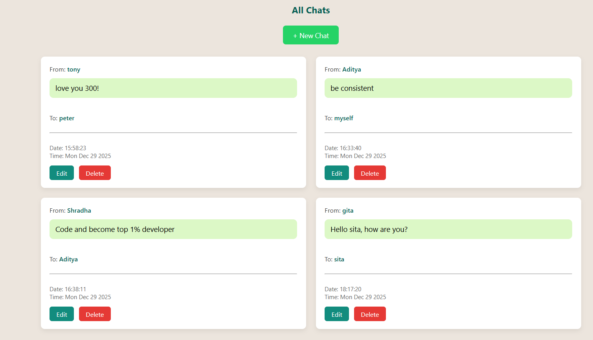
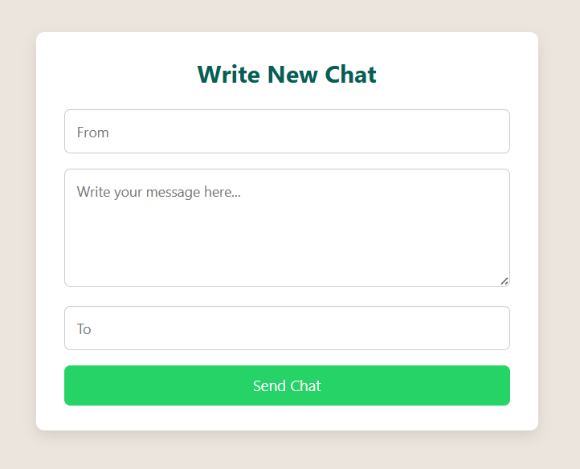
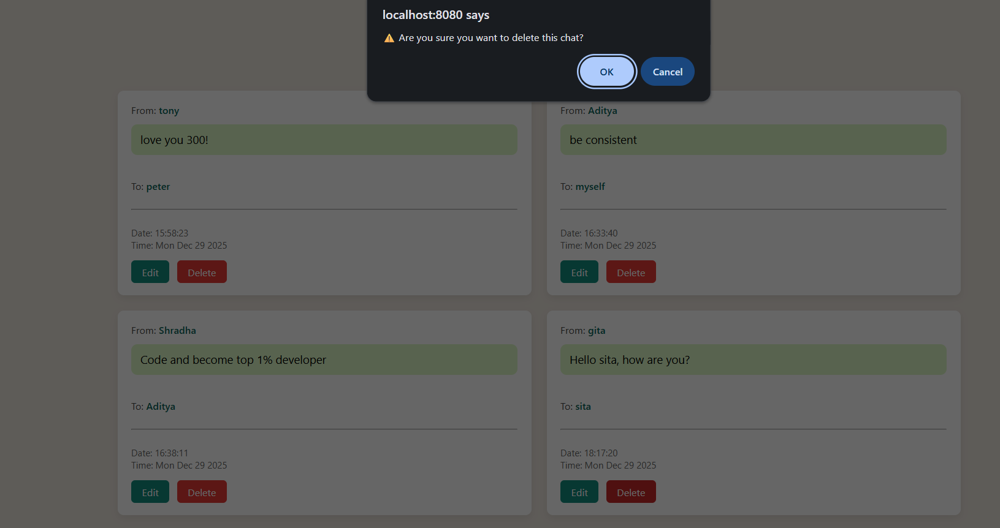

# 🚀 Mini WhatsApp – MongoDB CRUD Application

A **WhatsApp-style mini chat application** built using **Node.js, Express, MongoDB, Mongoose, and EJS**.  
This project demonstrates **RESTful CRUD operations**, server-side rendering, and a clean, responsive UI.

---

## ✨ Features

- 📩 Create new chats  
- 👀 View all chats  
- ✏️ Edit existing messages  
- 🗑️ Delete chats with confirmation  
- 🕒 Timestamped messages  
- 🎨 Clean and responsive UI  

---

## 🛠 Tech Stack

- **Backend:** Node.js, Express.js  
- **Database:** MongoDB, Mongoose  
- **Templating Engine:** EJS  
- **Middleware:** Method-Override  
- **Frontend:** HTML, CSS  
- **Version Control:** Git & GitHub  


## 📂 Project Setup

```bash
git clone https://github.com/your-username/mini-whatsapp-mongodb.git
cd mini-whatsapp-mongodb
npm install
node index.js

## 📸 Screenshots






## 🧠 What I Learned

- Implementing CRUD operations using **MongoDB & Mongoose**
- Designing **RESTful routes**
- Using **method-override** for PUT & DELETE requests
- Server-side rendering with **EJS**
- Improving UX with **confirmation alerts**
- Structuring and documenting a **real-world backend project**

---

## 🚀 Future Enhancements

- 🔐 User authentication
- 🌍 Deployment (Render / Railway)
- 📱 Mobile-first UI
- 🔍 Search & filter chats
- ☁ MongoDB Atlas integration

---

## 👤 Author

**Aditya Bhavsar**  
🎓 Computer Engineering Student  
💻 Aspiring Backend / Full-Stack giDeveloper  

---

⭐ If you like this project, consider giving it a star!
